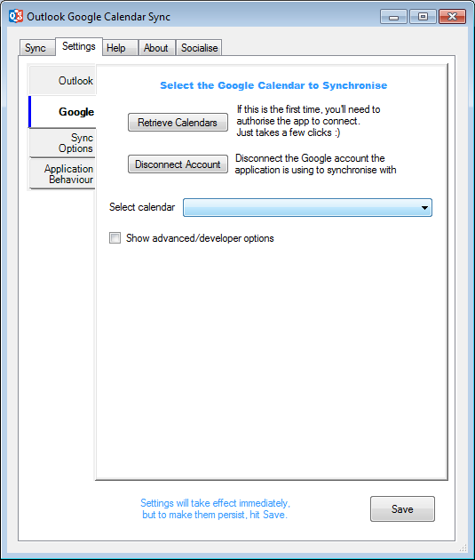



# Google Settings

This is where you configure the Google calendar you wish to sync. 

**Retrieve calendars:** Until you click this button, you will not be able to select the exact calendar. If this is the first time you are using OGCS, it will step you through the process of authorising the application to access your calendar.  
 

:memo: At no point do you have to provide OGCS your Google account password. Technically, a process called OAuth is used - from v2.6.1, once you have logged into Google a special authentication code will automatically be provided to OGCS. In earlier versions, you will need to manually copy and paste the code in to OGCS.

 

:warning: If you have used any other third party software and have entered your Google password directly into the application, it is strongly recommended you change your password immediately.
Disconnect Account: If you wish to go through the authentication process again, or change the Google account you previously configured OGCS to work with, then click this button.

 
If you wish to revoke authorisation from OGCS for accessing your calendar, navigate to [https://myaccount.google.com/permissions](https://myaccount.google.com/permissions), click on `Outlook Google Calendar Sync` and then `Remove Access`.

**Select calendar:** Once successfully authenticated, chose the calendar you wish to sync with.

### Advanced/developer options
This section allows users to utilise their own personal Google API quota. You will need to know the client ID and secret as provided within your Google developer console. Google Plus and Calendar APIs must be enabled for OGCS to work.

&nbsp;



&nbsp;

